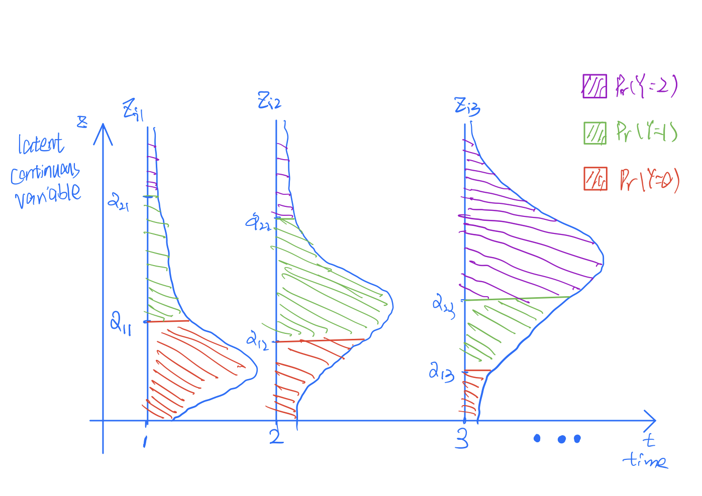

  
  
```{r global_options, include=FALSE}
knitr::opts_chunk$set(fig.width=12, fig.path='Figs/',echo=FALSE,  warning=FALSE, message=FALSE)
```


\maketitle

\begin{abstract}
This is a sample using R Markdown to generate reports in the form of the two-column ASA template. Latex is nice, but you still will have to keep track of all figures and tables yourself.  With R Markdown, you will be able to compile your entire exam paper with one button (or two,  ctrl+b, if you use Sublime Text). This saved me valuable time during numerous takehome exams during my first year. This template can be download from \href{https://github.com/jkang37/R-Markdown-Template}{my github}.


\begin{keywords}
R Markdown, ASA template
\end{keywords}
\end{abstract}
\section{Introduction}
\subsection{Use R Markdown with ASA template}

\textbf{The following steps is modified based on \href{https://jesscyzhao.github.io/teaching/2019-fall-stat204}{Chunyi's guide}. Thanks Chunyi!}

\textbf{Step 1:  acquire the template}

Download the asaproc.cls file and prefix.tex file into your working directory. asaproc.cls file is for the latex ASA format, and prefix.tex file contains title and author informtaion. You need to modify it with your own title and name. Just open prefix.tex file in RStudio and replace the content in title and author. 

\textbf{Step 2: prepare the .rmd file}

Download the asa_template.Rmd file. Keep everything above the \textit{$\backslash$maketitle} and you can modify things below it to your own content. This template provide some examples about include graphs, tables, equations and reference. When you write your own content, just follow those examples.


\textbf{Step 3: knit the .rmd file and you're done!}


\section{Some Easy Examples}

\subsection{Problem 1-2}

The plot is shown in Figure \ref{fig:fig1}.


```{r plot1,fig.cap="\\label{fig:fig1}Plot1",fig.height=5,cache=TRUE}
curve(dchisq(x,1),from=0,to=10,type='l',ylab='chi-square distribution')
```

The result shows the distribution of chi-square distribution.

\textit{A funny story:} Firstly I use this code to generate figure with caption and label but it just does not work. The solution turned out to be a little stupid but funny. The R Markdown compiler does not show captions for two consecutive figures or for a figure not separated from the text in a new paragraph. Therefore, just \textbf{use enough space} by pressing "Enter", and it will works! How amazing is coding!


\subsection{Problem 1-3}

Firstly, display curve of gamma with shape 1 and rate 1 in Figure \ref{fig:fig2}.


```{r,fig.cap="\\label{fig:fig2}Plot2",fig.height=5,cache=TRUE}
curve(dgamma(x,shape=1,rate=1),from=0,to=10,type='l',col='red',ylab='gamma distribution')
```


Then, we add gamma distribution with shape parameters equal to 2 and 3, and shows in Figure \ref{fig:fig3}.


```{r,fig.cap="\\label{fig:fig3}Plot3",fig.height=5,cache=TRUE}
curve(dgamma(x,shape=1,rate=1),from=0,to=10,type='l',col='red',ylab='gamma distribution')
curve(dgamma(x,shape=2,rate=1),from=0,to=10,type='l',col='blue',add=T)
curve(dgamma(x,shape=3,rate=1),from=0,to=10,type='l',col='purple',add=T)
legend("topright",legend=c('shape=1','shape=2','shape=3'),col=c('red','blue','yellow'),lty=1)
```


\subsection{Problem 1-6}


This example is used to generate table with caption and label, which is shown in Table \ref{tab:tab1}.

 

```{r tab1,results='asis',cache=TRUE}
winner = c(185, 182, 182)
opponent = c(175, 193, 185)
time=seq(2008,2000,by=-4)
df=data.frame(winner,opponent,time)
knitr::kable(df, "latex", booktabs = T,
            caption = 'President and opponent height')
```


\section{Implementation Details}

\subsection{Chunk Options}

This template frees you from switch between RStudio and your latex IDE by writing your report basically the same way as you do in latex in the main stream, and include your R code for computation, generating graphs and tables in chunks. The following R chunks are usually useful based on my experience. You can find more about chunck options from the \href{https://bookdown.org/yihui/rmarkdown/}{\textbf{Definitive Guide}}. (You can click the bold text and it should open your default browser and take you to the guide. This is also an example of including web links in your e-version report.)

- "cache": usually set to "TRUE".  If caching is enabled, the same code chunk will not be evaluated the next time the document is compiled. It saves a lot of time. 

- "eval": sometimes set to "FALSE" to code you have used but does not generate any tables or figures in your report.

- "results": sometimes set to "hide" to hide the output of the code. Useful when run MCMC. You may need to keep track of the loop, but you do not wnat to show it in your final report.

\subsection{Reference}

Some examples of reference is given here. The idea is to use a self-defined latex command \textit{$\backslash$labelText} (in the prefix.tex file if you are interested) and \textit{$\backslash$nameref} to refer, such as [\nameref{label:bda},\nameref{label:lecnotes},\nameref{label:mixedmodel}]. You can also refer to some text using this method, just replacing the number after \textit{$\backslash$labelText} with the text you want to refer.


\subsection{Equations}

I give some examples of writing equations here. Hopefully it covers the commonly used types of equations. 

- Simplest form: 

\begin{equation}
\mathcal{M}_1: y_{ij}=\mu+\delta_i+\epsilon_{ij}
\label{eq:02001}
\end{equation}

- Equation with matrix and bold greeks:

\begin{equation}
\boldsymbol{\omega}_{t} \sim N(\mathbf{0},
\begin{pmatrix} diag(\omega_{t1},\omega_{t2}) & \mathbf{0}_{2\times p}\\ \mathbf{0}_{p\times 2} & \mathbf{0}_{p\times p}\end{pmatrix})
\label{eq:02002}
\end{equation}

- Hierarchical model:

\begin{equation}
\begin{split}
&y_{kt}=\gamma_0+\gamma_1(5+t)+\epsilon_{kt},k=1,\cdots,20,t=1,\cdots,5\\
&\epsilon_{kt}|\sigma^2\stackrel{i.i.d.}{\sim}N(0,\sigma^2)\\
&\pi(\boldsymbol{\gamma},\sigma^2)=p(\boldsymbol{\gamma}|\sigma^2)\pi(\sigma^2)
\end{split}
\label{eq:02003}
\end{equation}

- Equations aligned:

\begin{equation}
\begin{split}
&\boldsymbol{\mu}^*_{\gamma}=(\mathbf{V}_{\gamma}^{-1}+X^TX)^{-1}(\mathbf{V}_{\gamma}^{-1}\boldsymbol{\mu}_{\gamma}+X^T\mathbf{y})\\
&\mathbf{V}^*_{\gamma}=((\mathbf{V}_{\gamma})^{-1}+X^TX)^{-1}\\
&a_{\sigma^2}^*=a_{\sigma^2}+\frac{n}{2}\\
&b_{\sigma^2}^*=b_{\sigma^2}+\frac{1}{2}[\boldsymbol{\mu}_{\gamma}^T\mathbf{V}_{\gamma}^{-1}\boldsymbol{\mu}_{\gamma}+\mathbf{y}^T\mathbf{y}-(\boldsymbol{\mu}^*_{\gamma})^T(\mathbf{V}^*_{\gamma})^{-1}\boldsymbol{\mu}^*_{\gamma}]
\end{split}
\label{eq:02004}
\end{equation}

- Equations aligned with a left bracket:

\begin{equation}
\left\{\begin{aligned} &\alpha_i=a_0+a_i &\quad i=1,2,3\\ &\beta_i=b_0+b_i &\quad i=1,2,3 \end{aligned}\right.
\label{eq:02005}
\end{equation}

- Long equations:

\begin{equation}
\begin{split}
&p(\boldsymbol{\gamma},\sigma^2|data)\propto p(\mathbf{y}|\boldsymbol{\gamma},\sigma^2)p(\boldsymbol{\gamma}|\sigma^2)\pi(\sigma^2)\\
&\propto (\frac{1}{\sigma^2})^{n/2}\exp\{-\frac{(\mathbf{y}-X\boldsymbol{\gamma})^T(\mathbf{y}-X\boldsymbol{\gamma})}{2\sigma^2}\}\\
&\times (\frac{1}{\sigma^2})^{p/2}\exp\{-\frac{(\boldsymbol{\gamma}-\boldsymbol{\mu}_{\gamma})^T\mathbf{V}_{\gamma}^{-1}(\boldsymbol{\gamma}-\boldsymbol{\mu}_{\gamma})}{2\sigma^2}\}\\
&\times(\frac{1}{\sigma^2})^{a_{\sigma^2}+1}\exp(-b_{\sigma^2}/\sigma^2)\\
&\propto(\frac{1}{\sigma^2})^{a_{\sigma^2}^*+1}\exp(-\frac{b_{\sigma^2}^*}{\sigma^2})\\
&\times(\frac{1}{\sigma^2})^{p/2}\exp\{-\frac{(\boldsymbol{\gamma}-\boldsymbol{\mu}^*_{\gamma})^T(\mathbf{V}^*_{\gamma})^{-1}(\boldsymbol{\gamma}-\boldsymbol{\mu}^*_{\gamma})}{2\sigma^2}\}\\
&\propto p(\sigma^2|data)p(\boldsymbol{\gamma}|\sigma^2,data)
\end{split}
\label{eq:02006}
\end{equation}

To refer to a equation, you first need to label it with something like \textit{eq:foo} (replace foo with your own name). Then the refering is down with latex command \textit{$\backslash$ref}, such as (\ref{eq:02001}), (\ref{eq:02004}).

\subsection{Tables}

\subsubsection{Using Latex Code}
You can use latex code to generate tables, like the following Table \ref{tab:02001}. 

\begin{table}[!ht] \centering 
  \caption{Summary of inference result for model $\mathcal{M}_2$ and $\mathcal{M}_3$.} 
  \label{tab:02001} 
\begin{tabular}{@{\extracolsep{5pt}}lcc} 
\\[-1.8ex]\hline 
\hline \\[-1.8ex] 
 & \multicolumn{2}{c}{\textit{Dependent variable:}} \\ 
\cline{2-3} 
\\[-1.8ex] & \multicolumn{2}{c}{Height} \\ 
\\[-1.8ex] & $\mathcal{M}_2$ & $\mathcal{M}_3$\\ 
\hline \\[-1.8ex] 
 $a_2$ & 1.674 & 4.051$^{***}$ \\ 
  & ($-$6.670, 10.018) & (2.586, 5.517) \\ 
  & & \\ 
 $a_3$ & 1.823 & 9.651$^{***}$ \\ 
  & ($-$6.521, 10.167) & (8.186, 11.117) \\ 
  & & \\ 
 $b_0$ & 5.270$^{***}$ & 5.716$^{***}$ \\ 
  & (4.516, 6.024) & (5.300, 6.133) \\ 
  & & \\ 
 $b_2$ & 0.297 &  \\ 
  & ($-$0.730, 1.324) &  \\ 
  & & \\ 
 $b_3$ & 0.979$^{*}$ &  \\ 
  & ($-$0.049, 2.006) &  \\ 
  & & \\ 
 $a_0$ & 81.300$^{***}$ & 77.728$^{***}$ \\ 
  & (75.177, 87.423) & (74.226, 81.230) \\ 
  & & \\ 
\hline \\[-1.8ex] 
R$^{2}$ & 0.907 & 0.903 \\ 
Adjusted R$^{2}$ & 0.902 & 0.900 \\ 
$\hat{\sigma}$ & 2.979 (df = 94) & 3.006 (df = 96) \\ 
\hline 
\hline \\[-1.8ex] 
\textit{Note:}  & \multicolumn{2}{r}{$^{*}$p$<$0.1; $^{**}$p$<$0.05; $^{***}$p$<$0.01} \\ 
\end{tabular} 
\end{table} 

The strength is you can use greek letters and subscript relatively easy in your table, but it will be really tedious if you have a large table. If you have a large table, I suggest use the following two ways. If you need to refer to the table, use \textit{$\backslash$ref} with something like \textit{tab:foo}

\subsubsection{Use Functions from Package knitr for General Tables}

```{r tab02002,results='asis',cache=TRUE}
winner = c(185, 182, 182, 188, 188, 188)
opponent = c(175, 193, 185, 187, 188, 173)
time=seq(2008,1988,by=-4)
df=data.frame(winner,opponent,time)
knitr::kable(df, "latex", booktabs = T,
            caption = 'President and opponent height')
```

The R package knitr have a function \textit{kable} that can generate tables directly. Table \ref{tab:tab02002} is an example. Notice here to refer to the table, you need to use something like \textit{tab:tabfoo} in \textit{$\backslash$ref}.

The default setting will have a empty line after every other five lines in the table. If you do not like it, see the code that generate Table \ref{tab:tab02003}.

```{r tab02003,results='asis',cache=TRUE}
winner = c(185, 182, 182, 188, 188, 188)
opponent = c(175, 193, 185, 187, 188, 173)
time=seq(2008,1988,by=-4)
df=data.frame(winner,opponent,time)
knitr::kable(df, "latex", booktabs = T,linesep = "",
            caption = 'President and opponent height')
```

The strength of this method is you do not need to input numbers by hand. Imagine how much time it can save for you if you have a very large table. However, if your table have complicated column names, like subscript or greek letters, this method may not be appealing. You can open the correspond .tex file and modified there, but do remember do this in the vary last step because if you knit the .Rmd file again, it will generate a new .tex file that replace the one you just revised!

\subsubsection{Use Package stargazer for Linear Regression Summary Table}

```{r,results='asis',cache=TRUE}
library(stargazer)

y=c(4,3,8,3,7,4,7,5,0,0,2,7,4,3,2,1,5)
X=matrix(c(1,0,0,0,0,0,0,
           1,0,0,0,0,0,0,
           1,0,0,0,0,0,0,
           0,1,0,0,0,0,0,
           0,1,0,0,0,0,0,
           0,1,0,0,0,0,0,
           0,0,1,0,0,0,0,
           0,0,1,0,0,0,0,
           0,0,1,0,0,0,0,
           0,0,0,1,0,0,0,
           0,0,0,1,0,0,0,
           0,0,0,1,0,0,0,
           0,0,0,0,1,0,0,
           0,0,0,0,1,0,0,
           0,0,0,0,0,1,0,
           0,0,0,0,0,1,0,
           0,0,0,0,0,0,1),ncol=7,byrow=TRUE)

dat=data.frame(X)
dat$y=y

lm2=lm(y~X1,data=dat)
lm3=lm(y~X1+X2,data=dat)

stargazer(lm2,lm3,title='Summary Statistics of Model 2 and Model 3',header = FALSE,label="tab:02004",ci=TRUE,digits = 2,keep.stat = c('rsq'))

```


The R package stargazer provide very fancy summary table for linear regression models, just like Table \ref{tab:02001}. Check the code that provide Table \ref{tab:02004} as an example.

Another example is given in Table \ref{tab:02005}. You can check out the code that provide this table in the .Rmd file.

```{r,results='asis',cache=TRUE}
mother=c(1,1,1,2,2,2,3,3,3,4,4,4,5,5,6,6,7)
mother=as.factor(mother)
lm1=lm(y~mother)

stargazer(lm1,title='Summary Statistics of Model 1',header = FALSE,label="tab:02005",ci=TRUE,digits=7)

```

\subsection{Figures}

- \textbf{Simple Figures}

```{r,fig.cap="\\label{fig:02001}GLM EDA For Choose Link Function.",fig.height=5,cache=TRUE}
library('MASS')
speed=c(340,570,340,570,340,570,340,570,440,440,440,440,305,635,440,440,440,440,
        305,635,440,440,440,440)
time=c(70,29,60,28,64,32,44,24,35,31,38,35,52,23,40,28,46,33,46,27,37,34,41,28)

df=data.frame(speed,time)

model_gamma1=glm(time~speed,family = Gamma(link='log'))
model_gamma2=glm(time~speed,family = Gamma(link='inverse'))
model_ig1=glm(time~speed,family = inverse.gaussian(link = '1/mu^2'))
model_ig2=glm(time~speed,family = inverse.gaussian(link = 'log'))


plot(df$speed,df$time,type='p',pch=1,xlab='speed',ylab='faliure time',
     main='')
lines(sort(unique(df$speed)),sort(unique(fitted(model_gamma1)),decreasing = T),
      col='red',lty=2)
lines(sort(unique(df$speed)),sort(unique(fitted(model_gamma2)),decreasing = T),
      col='blue',lty=3)
lines(sort(unique(df$speed)),sort(unique(fitted(model_ig1)),decreasing = T),
      col='purple',lty=4)
lines(sort(unique(df$speed)),sort(unique(fitted(model_ig2)),decreasing = T),
      col='green',lty=5)
legend("topright",legend=c('gamma-log','gamma-invers','IG-inverse squared','IG-log'),
       lty=2:5,col=c('red','blue','purple','green'))
```

- \textbf{Arrange Figures}

```{r,fig.cap="\\label{fig:02002}Residual plot of the linear regression model.",fig.height=10,cache=TRUE}
par(mfrow=c(2,2))
plot(lm1,which=1:4)
```

- \textbf{Include Figures that are not generated by R}

```{r,fig.cap="\\label{fig:02003}Illustrate modeling ideas for latent continuous variable $Z$.",fig.height=5,cache=TRUE}


```

To refer to a figure, use \textit{$\backslash$ref$\{$fig:foo$\}$} such as Figure \ref{fig:02001}, Figure \ref{fig:02003}.


\begin{references}
{\footnotesize
\itemsep=3pt

\item \labelText{$1$}{label:bda}. Gelman, Andrew, Carlin, John B., Stern, Hal S. and Rubin, Donald B. (2014),  "Bayesian Data Analysis (3rd Editon)", {\em Chapman and Hall/CRC}, ISBN 978-1-4398-9820-8.

\item \labelText{$2$}{label:lecnotes}. Sans{\'o}, Bruno (2020),  "Lecture Notes on Intermediate Bayesian Statistical Modeling", available at \href{https://stat207-spring20-01.courses.soe.ucsc.edu/home}{UCSC course website}.

\item \labelText{$3$}{label:gold}. Goldstein, H. (1979), "The Design and Analysis of Longitudinal Studies", London: Academic Press.

\item \labelText{$4$}{label:mixedmodel}. Verbeke, G., and Molenberghs, G. (2000), "Linear Mixed Models for Longitudinal Data", New York: Springer-Verlag.

\item \labelText{$5$}{label:jimcompute}. Albert, J. (2009), "Bayesian Computation with R (2nd Edition)", {\em Springer}, ISBN 978-0-387-92297-3.

\item \labelText{$6$}{label:faraway}. Faraway, J. (2014). "Linear Models with R (2nd Edition)", {\em Chapman and Hall/CRC}, ISBN 978-1-4398-8734-9.

\item \labelText{$7$}{label:firstcourse}. Hoff, P. (2009), "A First Course in Bayesian Statistical Methods", {\em Springer Texts in Statistics}, ISBN 978-0-387-92299-7.

\item \labelText{$8$}{label:choice}. Robert, Christian P. (2007),  "The Bayesian Choice (2nd Edition)",
{\em Springer Texts in Statistics}, ISBN 978-0-387-71598-8.

\item \labelText{$9$}{label:criteria}.  Gelfand, Alan and Ghosh, Sujit (1998), "Model choice: A minimum posterior predictive loss approach", {\em Biometrika, Volume 85, Issue 1}, Pages 1–11.

\item \labelText{$10$}{label:lmnotes}. Lund, Robert (2020),  "Lecture Notes on Linear Statistical Models", available at \href{https://canvas.ucsc.edu/courses/33166/files}{UCSC Canvas}.

}


\end{references}


\appendix
\section{Include R code in Appendix}

Just set the chunk option \textit{echo} to \textbf{TRUE} and \textit{eval} to \textbf{FALSE}. See below.

```{r,echo=TRUE,eval=FALSE}
## fit linear models
lm1=lm(height~group,data=dat)
L1=lm(height ~ group*age,data=dat)
lm2=lm(height~group+age,data=dat)

## plot residual
par(mfrow=c(1,2))
plot(lm2,which=1:2)

## test residual
n=nrow(dat)
sample.res.corr=function(h){
  numerator=sum(lm2$residuals[1:(n-h)]
                *lm2$residuals[(h+1):n])
  denominator=sum(lm2$residuals^2)
  return(numerator/denominator)
}

Q=sapply(seq(1,5,by=1), sample.res.corr)
Q=n*sum(Q^2)

res.vs.norm=qqnorm(lm2$residuals,
                   plot.it = FALSE)
(cor(res.vs.norm$x,res.vs.norm$y))^2
```


